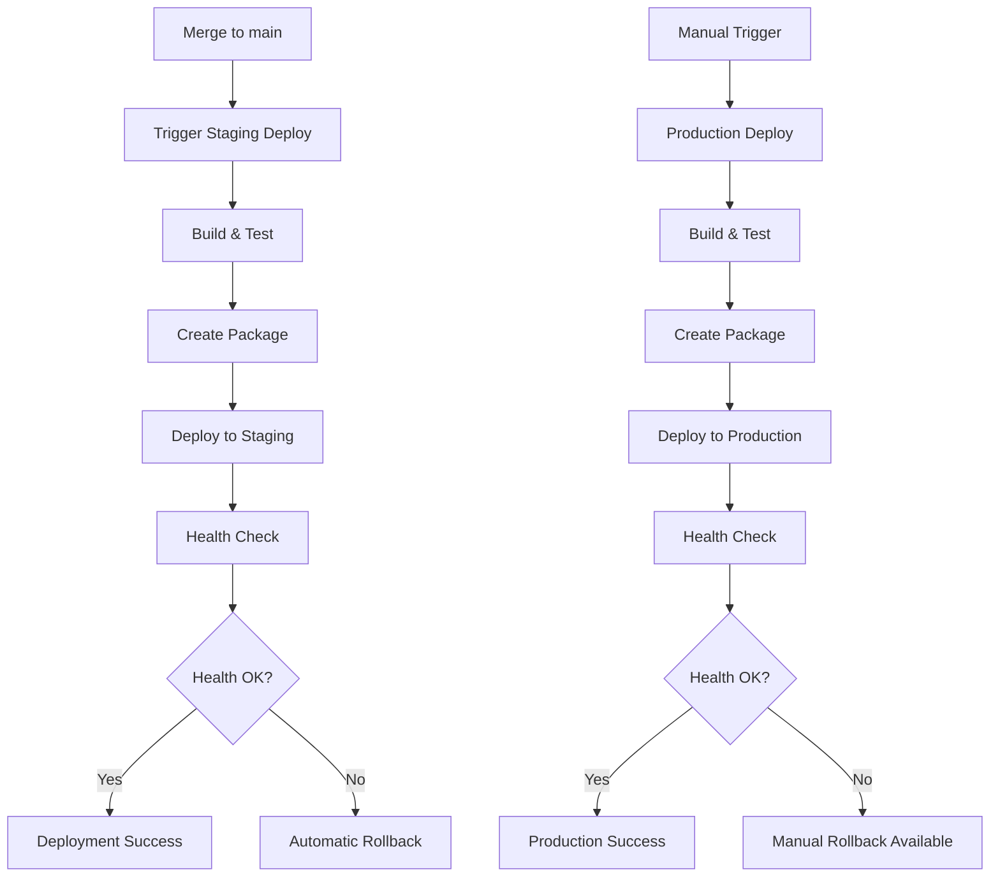

# GameConsole Deployment Pipeline

This directory contains the automated deployment pipeline for the GameConsole application, implementing RFC-012 deployment automation.

## Overview

The deployment pipeline provides:
- **Automated staging deployment** after successful merges to main
- **Manual production deployment** with approval gates
- **Health checking** and validation
- **Rollback capabilities** for failed deployments
- **Environment-specific configurations**

## Components

### GitHub Actions Workflows

| Workflow | Trigger | Purpose |
|----------|---------|---------|
| `deploy-staging.yml` | Push to main | Automatic staging deployment |
| `deploy-production.yml` | Manual/Release | Production deployment with approvals |

### Deployment Scripts

| Script | Purpose |
|--------|---------|
| `deploy.sh` | Core deployment automation |
| `health-check.sh` | Post-deployment validation |
| `rollback.sh` | Rollback failed deployments |

## Usage

### Staging Deployment
Staging deployments happen automatically when code is merged to the main branch:

```bash
# Automatic after merge to main
git push origin main
```

### Production Deployment
Production deployments are manual and require approval:

```bash
# Via GitHub Actions UI (workflow_dispatch)
# Or via CLI:
gh workflow run deploy-production.yml \
  -f environment=production \
  -f version_tag=v1.0.0
```

### Manual Deployment
Use the deployment script directly:

```bash
# Deploy to staging
./scripts/deployment/deploy.sh staging gameconsole-staging-abc123.tar.gz

# Deploy to production with custom timeout
./scripts/deployment/deploy.sh production gameconsole-production-v1.0.0.tar.gz --timeout 600
```

### Health Checks
Run health checks manually:

```bash
# Check staging environment
./scripts/deployment/health-check.sh staging

# Check production with custom retry settings
./scripts/deployment/health-check.sh production --retry-count 5 --timeout 60
```

### Rollback
Rollback a failed deployment:

```bash
# Rollback to previous version
./scripts/deployment/rollback.sh production

# Rollback to specific version
./scripts/deployment/rollback.sh production --target-version v1.0.0

# Force rollback without confirmation
./scripts/deployment/rollback.sh staging --force --skip-health-check
```

## Environment Configuration

### Staging Environment
- **Purpose**: Validate deployments before production
- **Trigger**: Automatic on merge to main
- **Approval**: None required
- **Health Checks**: Enabled by default

### Production Environment
- **Purpose**: Live production environment
- **Trigger**: Manual workflow dispatch or release
- **Approval**: Required (configured in GitHub environment settings)
- **Health Checks**: Mandatory with strict timeouts

## Integration with Existing Automation

The deployment pipeline integrates seamlessly with the existing automation:

1. **Issue Creation** → RFC issue created
2. **PR Automation** → Copilot creates PR
3. **CI/CD Testing** → Automated testing via existing ci.yml
4. **PR Merge** → Existing merge automation
5. **🆕 Staging Deployment** → New: Automatic staging deployment
6. **🆕 Production Deployment** → New: Manual production deployment

## Deployment Flow



## Monitoring and Notifications

- **Deployment Status**: Visible in GitHub Actions
- **Health Check Results**: Logged in deployment output
- **Failure Notifications**: Workflow failure notifications
- **Rollback Alerts**: Automatic notifications on rollback

## Security Considerations

- **Environment Secrets**: Managed via GitHub Secrets
- **Approval Gates**: Production deployments require approval
- **Access Control**: Environment-specific access controls
- **Audit Trail**: All deployments logged in GitHub Actions

## Troubleshooting

### Common Issues

1. **Deployment Package Not Found**
   - Ensure the package was created in the build step
   - Check artifact upload/download steps

2. **Health Check Failures**
   - Review health check logs for specific failures
   - Increase timeout if needed
   - Check application startup logs

3. **Rollback Issues**
   - Verify backup packages exist
   - Check rollback script permissions
   - Ensure target version is available

### Debug Commands

```bash
# Test deployment script locally
./scripts/deployment/deploy.sh --help

# Test health checks
./scripts/deployment/health-check.sh staging --retry-count 1

# Check workflow status
gh run list --workflow=deploy-staging.yml --limit 5

# View deployment logs
gh run view <run-id> --log
```

## Future Enhancements

- Database migration support
- Blue-green deployment strategy  
- Automated performance testing
- Integration with monitoring systems
- Multi-region deployment support

## Related Documentation

- [RFC-012: Deployment Pipeline Automation](../docs/game-rfcs/RFC-012-deployment-pipeline-automation.md)
- [Automation Pipeline Overview](../docs/automation/AUTOMATION_PIPELINE.md)
- [CI/CD Workflows](../.github/workflows/)